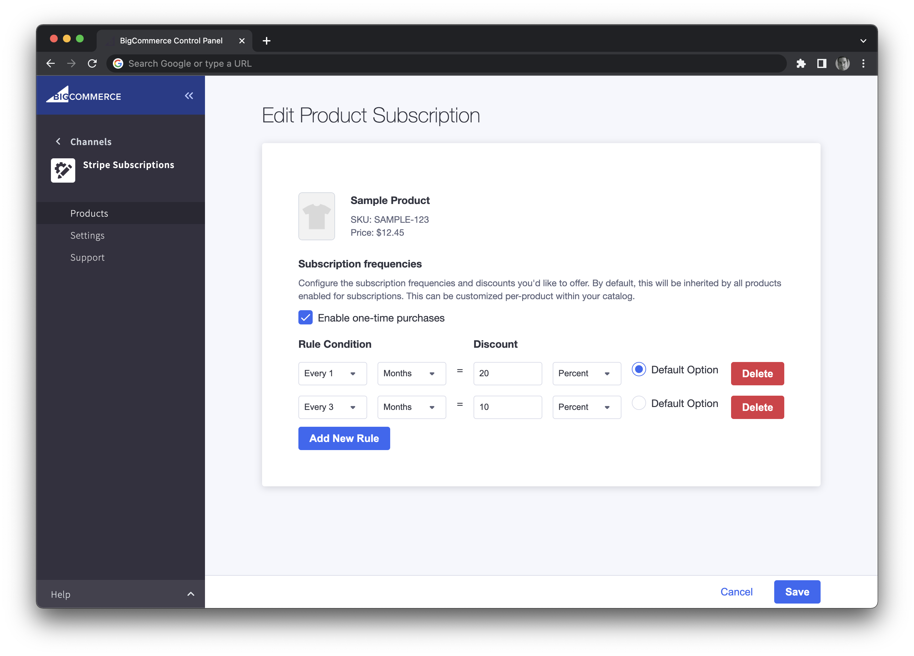
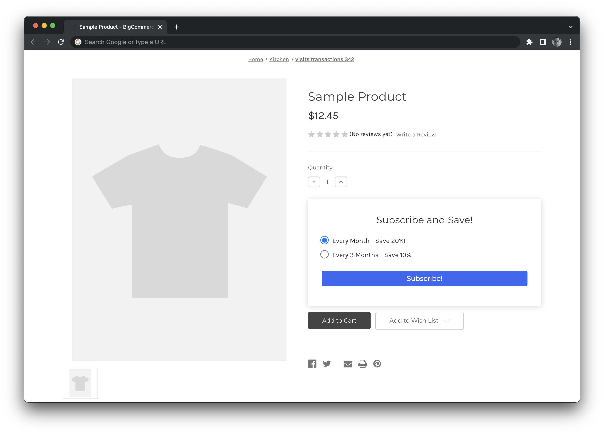

# BigCommerce Subscription Foundation

🚀 Fast track builds of custom subscription experiences on the BigCommerce platform. Save 100s of hours.

💰 **Pre-integrated into Stripe Billing**, including authentication, merchant onboarding, subscription product management, subscription creation, and customer-facing subscription management.

💅 Utilizes the Channels Toolkit to provide a natively integrated subscription channel that fits nicely within the BigCommerce control panel.

| Product Management                       | Storefront Widget                     |
| ---------------------------------------- | ------------------------------------- |
|  |  |

## Prerequisites

You will need the following:

* [BigCommerce sandbox store](https://developer.bigcommerce.com/docs/ZG9jOjM4MzMyNTE-create-a-sandbox-store?source=subscription-foundation) (required to develop and test apps)
* [Developer Portal Account](https://devtools.bigcommerce.com/?source=subscription-foundation) (required to register apps)
* Experience using [npm](https://www.npmjs.com/)
* Node.js 14.x

## Get started

1. Start by forking the subscription-foundation repository.
2. Navigate to the root directory of your project and install npm packages.

```shell
npm install
```
## Using ngrok

You will need a publicly accessible URL to connect the draft app to BigCommerce. To add network access while in the development phase, you can use [ngrok](https://ngrok.com/docs), a free tool that lets you expose local servers like `localhost:3000` to the public internet over secure tunnels.

1. In a new terminal window, install [ngrok](https://www.npmjs.com/package/ngrok#usage).

```shell
npm install ngrok -g
```

2. Expose the web server on port 3000 to the internet.

```shell
ngrok http 3000
```
In a later step, you will use the public-facing URL to update the environment variable `NEXT_PUBLIC_APP_URL` in the .env file.

<!-- theme: info -->
> #### Note
> Although you can use the `ngrok` npm package without creating an account, any unauthenticated tunnels you create will expire after two hours. For the best development experience, [create a free ngrok account](https://dashboard.ngrok.com/signup), [find your ngrok authtoken](https://dashboard.ngrok.com/get-started/your-authtoken), and [add the authtoken](https://ngrok.com/docs#getting-started-authtoken) to your global `ngrok` configuration.

## BigCommerce Setup

This app gets access to the BigCommerce API by being installed on the store. You'll need two things to test out this flow:

1. [Create BigCommerce store](https://developer.bigcommerce.com/docs/ZG9jOjM4MzMyNTE-create-a-sandbox-store?source=subscription-foundation): go to [https://www.bigcommerce.com/essentials/](https://www.bigcommerce.com/essentials/?source=subscription-foundation) and signup for a free trial if you don't have one.

2. [Create BigCommerce app](https://developer.bigcommerce.com/docs/ZG9jOjM4MzMzNzM-managing-apps-in-the-developer-portal#creating-apps?source=subscription-foundation): go to [https://devtools.bigcommerce.com](https://devtools.bigcommerce.com?source=subscription-foundation) and create a draft app with the following callbacks (in the 2nd, 'Technical' step of app creation):

- Auth Callback URL: https://{ngrok_id}.ngrok.io/api/auth
- Load Callback URL: https://{ngrok_id}.ngrok.io/api/load
- Uninstall Callback URL: https://{ngrok_id}.ngrok.io/api/uninstall

In the next section below, set the following OAuth Scopes for the app:

```
Orders: MODIFY
Order Transactions: MODIFY
Products: MODIFY
Customers: MODIFY
Content: MODIFY
Carts: MODIFY
Channel Listings: MODIFY
Channel Settings: MODIFY
Information & Settings: MODIFY
Sites & Routes: READ-ONLY
Storefront API Tokens: GENERATE TOKENS
```
Click **Update & Close**.

3. After creating the app, click on 'View Client ID' within the Dev Tools app list to get your Client ID and Client Secret. In a later step, you will use these variables to update `BC_APP_CLIENT_ID` and `BC_APP_SECRET` in the .env file.

## Stripe Setup

The app is setup to connect multiple BC Stores into one instance. Because of this, you’ll need two Stripe accounts. One for the ‘Connect’ account which the app will use and another which is what the merchant connects to the app and BC store (in the payments area) themselves.

To accomplish this:

1. Create a Stripe account you’ll use to accept payments and manage subscriptions on BigCommerce: https://stripe.com/
2. After you have created that account, log into the Stripe Dashboard: https://dashboard.stripe.com/
3. Create a separate Stripe account that the application uses to OAuth the merchant.
   1. This can be done by selecting ‘+ New Account’ after clicking the name of the current account on the top left of your Stripe Dashboard.
   2. Pick a name for this account, like ‘BigCommerce App’ that helps you differentiate it from the Stripe payment account.
4. Get your Stripe secret key here: https://dashboard.stripe.com/test/apikeys
   1. Reveal the secret key under ’Standard Keys’.
   2. In a later step, you will use the secret key to update the environment variable `STRIPE_SECRET_KEY` in the .env file.
5. Enable Stripe Connect for Platforms here: https://dashboard.stripe.com/test/connect/accounts/overview
   1. Select ‘Platform or Marketplace’ and continue.
   2. While not required for testing, as part of going live later, you’ll need to fill out the platform profile. We suggest using these answers at that point:
      - Select ‘Other’ for industry.
      - Select ‘From your seller/service provider’s website or app’ for where customers purchase products or services.
      - Select ‘The name of the seller/service provider using your platform’ for whose name is on the customer’s credit card statement.
      - Select ‘The seller/service provider using your platform’ for who should be contacted if customers have a dispute or complaint.
6. Configure your Connect settings here: https://dashboard.stripe.com/test/settings/connect
   1. Copy ’Test mode client ID’. In a later step, you will use the client ID to update the environment variable `NEXT_PUBLIC_STRIPE_CLIENT_ID` in the .env file.
   2. Under ‘OAuth settings’ enable ‘OAuth for Standard accounts’.
   3. Under ‘Redirects’ add the following URI: https://{xxxx-xxx-xxx-xx-x.ngrok.io}/stripe/callback
      
7. Your app should now be set up to handle Stripe OAuth, API requests, and webhooks.
   1. Remember the merchant must OAuth the same Stripe payments account (what you created first) to this app that their BigCommerce store uses.     Otherwise, the initial payment created when the shopper pays for the original order won’t be readable when creating subscriptions.
   2. When testing:
      - Make sure 'Test Mode' is set to ‘Yes’ in the merchant’s Stripe settings within BigCommerce: https://login.bigcommerce.com/deep-links/settings/payment/stripev3
      
      
      
      - A vaulted card must be used when checking out. Turn on that functionality by going to ‘Stored Credit Cards’ in the Stripe payments section in BigCommerce and toggling on ‘Enable stored credit cards with Stripe’. 
      
      - When checking out on the BigCommerce store, you can save the card by logging in as a customer (or creating a new account during checkout) and selecting ‘save this card for later’ in the payments step.

## Create environment file

1. Create a `.env` file in the root directory of your project.

2. Copy the content of `.env-sample` to `.env`.
```shell
cp .env.sample .env
```
At a minimum, you need to update the following .env variables for the app to run successfully inside the BigCommerce control panel and storefront.

- `NEXT_PUBLIC_APP_URL`
  - This should be a publicly accessible URL so the BigCommerce Stripe webhooks can be received. See the section on [ngrok](#using-ngrok).
- `NEXT_PUBLIC_APP_ID`, `BC_APP_CLIENT_ID`, and `BC_APP_SECRET`
  - Follow the [BigCommerce setup](#bigcommerce-setup) instructions to get these.
- `STRIPE_SECRET_KEY` and `NEXT_PUBLIC_STRIPE_CLIENT_ID`
  - Follow the [Stripe setup](#stripe-setup) instructions to get these.

## Install app dependencies

1. Create the DB tables and initial client. If you miss this step, you’ll see errors about Prisma missing.
```shell
npx prisma migrate dev
```


NOTE:  This example uses SQLite as a data store. In production, we recommend using a database that has more robust concurrency support, such as PostgresSQL. For information on switching databases, see the [Replacing SQLite](#replacing-sqlite) section.

2. Run app.

```shell
npm run dev
```
The app should now be installable as a draft app on your BigCommerce store.


## Replacing SQLite
To replace the SQLite database, do the following:

1. Update the `/prisma/schema.prisma` file with a `provider` other `sqlite` (i.e. `PostgreSQL`. info on options are here: https://www.prisma.io/docs/reference/tools-and-interfaces/prisma-schema/data-sources/)
2. Update the `DATABASE_URL` var in `/prisma/.env` to match your new DB connection string.
3. Run `npx prisma migrate dev` (this creates tables and inserts related data as defined in `/prisma/migrations/*` into the DB).
4. Run `npx prisma generate` (this generates a new client for the app using the new DB provider setting).

After all this, if you run `npx prisma studio` you'll be able to access this database locally via a visual editor and verify the table has been created.


## Managing subscription products

Subscription-specific product configuration, like available intervals and the discount associated with them, is done within the app, inside Channel Manager. Only products that are listed on the subscription channel show up here. You can list products to the channel from within the Products section of the BigCommerce control panel.

## Troubleshooting

### Seeing {"error": "Not found"} when installing the app

If you don't request the proper scopes, the /api/auth request might fail. Check your scopes in the BigCommerce Dev Tools area. Look at the scopes listed above in the [BigCommerce setup](#bigcommerce-setup) section.

## Key areas of codebase

- `/backend`
  - Where the auth and various API services live. These are uses within the internal API endpoints to keep routes secure and reach out to external APIs.
- `/prisma`
  - Where the DB models and initial seed data lives. Prisma uses this to generate DB clients for the app.
- `/shared`
  - Where the types and helper utilities are located.
- `/src/pages`
  - Where the sections of the app, including the UI for the BigCommerce app that will show inside the control panel, are managed.
  - Next.js docs: https://nextjs.org/docs/basic-features/pages
- `/src/pages/api`
  - Where the APIs for the app are managed.
  - Next.js docs: https://nextjs.org/docs/api-routes/introduction
    - `/cart`, `/channel`, and `/product`: Contains endpoints that proxy to BigCommerce APIs.`
    - `/store`: Contains endpoints that update app information in the DB.`
    - `/stripe`: Contains endpoints that proxy to Stripe APIs.`
    - `/webhooks/index.ts`: Contains the webhook listener for the "Order Created" BigCommerce event which is used to create the initial Stripe subscription.
- `/src/providers`
  - Where the context providers used within pages and components live.

## Contributing

Want to help expand this foundation? We'd love to collaborate! To kick off, here's a breakdown of items we've itemized as either potential improvements to the existing codebase or features worth adding.

- Improvements:
  - Implement cart metafields to improve shopper UX (removes overloading of product name)
  - Move FE cart requests / calculations within subscription widget to be handled within single internal API endpoint
  - Centralize logging so it's easily turned on / off and connected into third-party logging services
- Features:
  - Additional subscription use cases outside of 'Subscribe and Save'
  - Handling for more complex tax and shipping scenarios, changes occurs to price after initial subscription creation
  - Ability to see subscription information inline, within My Account -> Order section of storefront

## Learn More

### Additional Subscription Solutions

Check out the wide variety of subscription apps on the [BigCommerce App Marketplace](https://www.bigcommerce.com/apps/recurring-billing-subscriptions/?source=subscription-foundation).

### The BigCommerce Platform

Looking to help the world's leading brands and the next generation of successful merchants take flight? To learn more about developing on top of the BigCommerce platform, take a look at the following resources:

- [BigCommerce Developer Center](https://developer.bigcommerce.com/?source=subscription-foundation) - Learn more about BigCommerce platform features, APIs and SDKs
- [BigDesign](https://developer.bigcommerce.com/big-design/?source=subscription-foundation) - An interactive site for BigCommerce's React Components with live code editing
- [Building BigCommerce Apps](https://developer.bigcommerce.com/api-docs/getting-started/building-apps-bigcommerce/building-apps?source=subscription-foundation) - Learn how to build apps for the BigCommerce marketplace
